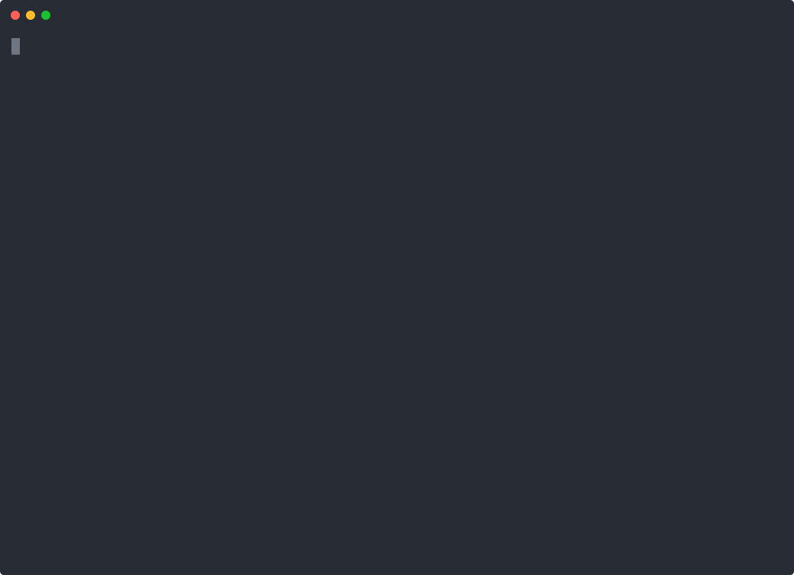

# Better Every Run

Lightweight run learning for OpenClaw agents.

Better Every Run turns explicit `/ber` corrections into future behavior. It does not auto-capture casual chat. The user gives a short command, and the agent reports what was recorded and where it was stored. Accepted lessons now carry scope, expiry, status, promotion hints, lesson cards, scanner verdicts, target hashes, lifecycle metadata, and eval-fixture output so an agent can decide whether a correction should stay local or become memory, a skill rule, or a regression case.

## Install

### OpenClaw / ClawHub

```bash
openclaw skills install better-every-run
```

### Manual

```bash
git clone https://github.com/LeoStehlik/better-every-run.git ~/.openclaw/workspace/skills/better-every-run
```

For Claude Code, Codex, or other agent harnesses, copy this folder into the harness skill directory and load `SKILL.md`.

## Human Surface

In OpenClaw chat:

```text
/ber fix vague status update -> exact command output and next action
/ber remember design software for humans from the shortest path to outcome
/ber report
```

The agent handles the local helper, then tells the human whether the lesson stayed in the project-local `.better-every-run/` store or was appended to a named durable memory file.

## Product Rule

- The skill runs only from explicit `/ber` use or a direct request to persist a lesson.
- Humans should not manage accept/export/apply steps during normal use.
- The agent should summarize the outcome in chat, including the storage location.
- Lesson metadata should explain the intended scope: `run`, `project`, `workspace`, `skill`, `memory`, or `eval`.
- Durable memory writes must be explicit and target a real file.
- No plugin, server, web UI, database, or external service is required.

## Storage

The helper writes a project-local evidence trail under `.better-every-run/`. That folder should stay private, be excluded from publishing, and can be reviewed or deleted by the workspace owner.

## Internal Helper

The bundled helper is for agents, tests, and audits. Keep normal chat short, but disclose persistence and durable target files clearly. Promotion commands are agent-facing: `card --to memory|skill|eval` writes a lesson card with scanner state and target hash; `promote --to memory|skill|eval --require-card` appends only when the card is still fresh; `eval-fixture` turns a correction into a JSON regression case.

## Upstream Of Skills, Memory, And Evals

BER is deliberately upstream of heavier machinery:

- Use `/ber fix` when the human corrects a bad outcome.
- Use `/ber report` to see accepted lessons, open proposals, expired lessons, lifecycle counts, and promotion suggestions.
- Write a lesson card before durable promotion so stale targets and scanner issues are caught before a file is changed.
- Quarantine one-off/bad lessons and supersede stale lessons when a better rule replaces them.
- Promote only the lessons that deserve durability. Memory captures operating preferences, skills capture reusable behavior, and eval fixtures capture regressions that should fail if the agent slips again.

See `examples/upstream-loop.md` for the end-to-end flow.

## Credibility Artifact



## Repository

```text
better-every-run/
├── SKILL.md
├── assets/
│   ├── better-every-run-terminal-demo.cast
│   └── better-every-run-terminal-demo.svg
├── examples/
│   ├── asciinema-demo.sh
│   ├── demo.md
│   ├── terminal-demo.md
│   └── upstream-loop.md
├── references/
│   ├── report-template.md
│   └── workflow.md
├── scripts/
│   ├── ber
│   └── ber.js
├── tests/
│   └── smoke.sh
├── Makefile
└── README.md
```

## Status

Usable public skill bundle, published on ClawHub as `better-every-run@0.5.4`. The GitHub repo also carries the terminal demo proof artifact.


## Verify

```bash
make test
```
